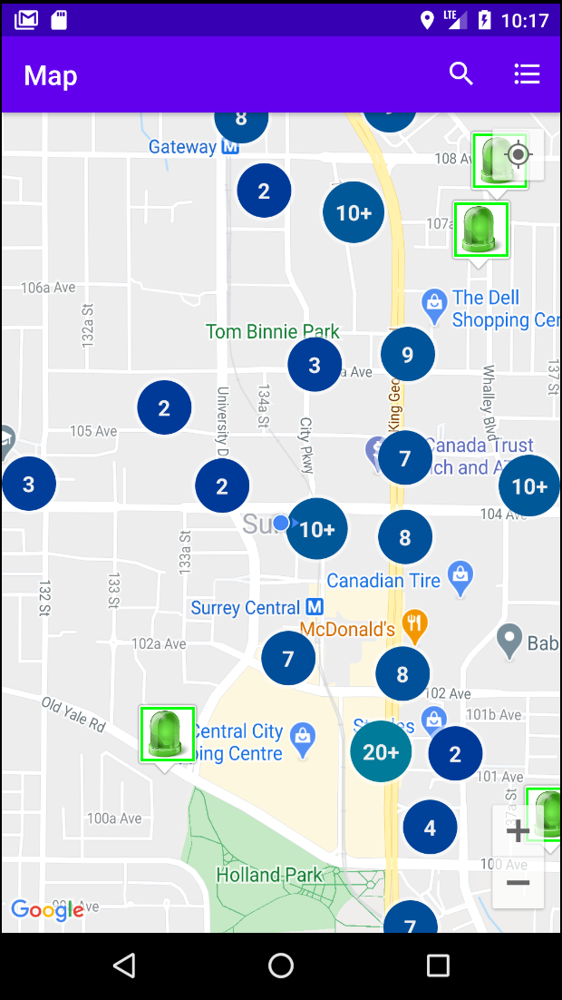
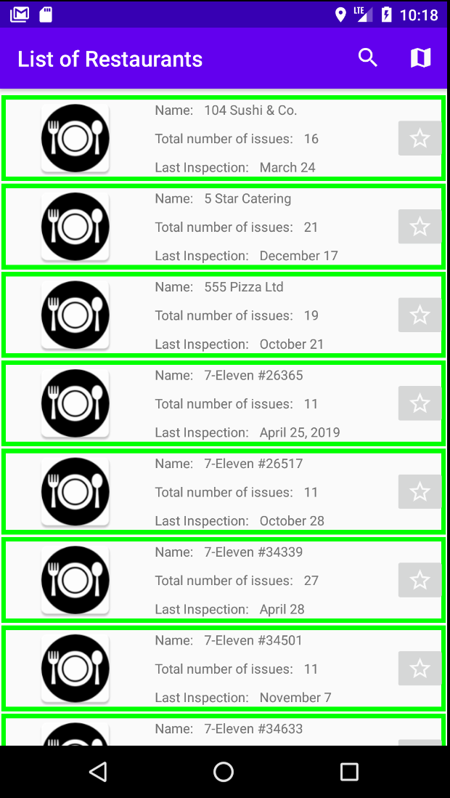
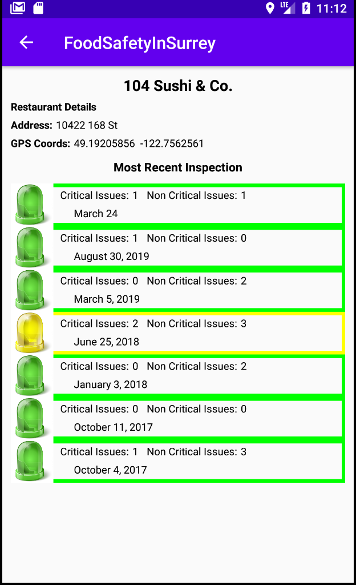
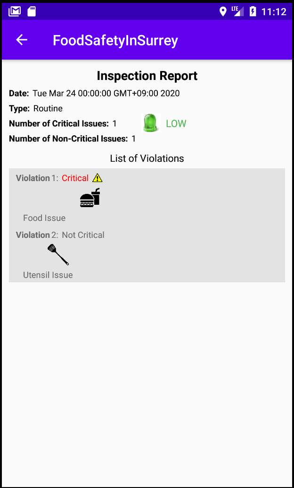

# RestaurantHealthApp
This project was originally a group project in the software engineering course. I worked in a group of 4 people for 3 iterations (each iteration is 2 weeks), adopting Scrum process. I played roles in Product owner, Team member, and Scrum master in each iteration.
Since we did not take Android Architecture into consideration at that time, this is the version after I made various modifications to the original project. Hopefully, this would show my understanding of MVVM, one of major Android Architectures.

This app shows the hygiene of local restaurants in Surrey (a city close to Vancouver in Canada) based on the open-source data available in https://data.surrey.ca/. Each restaurant has a record of health inspections and each inspection is evaluated by a hazard level(Low, Moderate, or High) depending on the nature and the number of violations found at that time. With this app, users can easily check the hygienic status of various local restaurants and enhance the awareness of their food safety in their neighborhood.

## Each State of this app

1. WelcomeActivity

  - load local CSV file and save data into database if the app launches for the first time
  - ask a user if they would like to check new data available in remote API
  - if a user answered no, start next activity (RestaurantListActivity) immediately
  - if a user answered yes and there is any update in the remote CSV file, fetch new data from the CSV file and save it into database
  - start RestaurantListActivity once fetching from remote API and storing new data into database has finished
 
2. RestaurantListActivity

  - display either MapFragment or ListFragment at a time. Switched by the map/list icon on the toolbar.
  - allow users to search restaurants with various requirements by clicking search icon on the toolbar.
  - start the next Activity (RestaurantDetailActivity) if its child fragment requested
  
MapFragment

  - show all restaurants on the Map at the correct location. The LED icon's color corresponds to the hazard level of the most recent inspection.
  - enable users to show the list of inspections of a restaurant they clicked on its window in the next activity (RestaurantDetailsActivity).

ListFragment

  - show all restaurants in a RecycleView
  - allow users to click each row and show the list of inspections of that restaurant in the next activity (RestaurantDetailsActivity).
  
3. RestaurantDetailActivity

  - display all the past inspection of a restaurant a user clicked in either MapFragment or ListFragment
  - let a user click each row, starting the next activity (InspectionDetailActivity)

4. InspectionDetailActivity

  - display all violations of a specific inspection
  - user can see more details of a violation by clicking on each row
  
## How to use this app

Since this application uses Google Map and Places API, you will need to get your own API key to experience the full functionality of this app. Once you issued your own API key, search for google_maps_api.xml and paste your key inside a string resource.

## Library reference resources:

1. RxJava2: https://github.com/amitshekhariitbhu/RxJava2-Android-Samples
2. Room: https://developer.android.com/topic/libraries/architecture/room.html
3. Google Map and Places: https://developers.google.com/maps/documentation
4. Restaurants: http://data.surrey.ca/dataset/restaurants
5. Fraser Health Restaurant Inspection Reports: https://data.surrey.ca/dataset/fraser-health-restaurant-inspection-reports 
