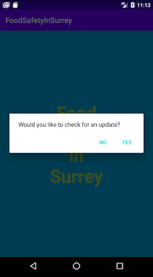

# RestaurantHelathApp
This project was originally a group project in the software engineering course. I worked in a group of 4 people for 3 iterations (each iteration is 2 weeks), adopting Scrum process. I played roles in Product owner, Team member, and Scrum master in each iteration.
Since we did not take Android Architecture into consideration at that time, this is the version after I made various modifications to the original project. Hopefully, this would show my understanding of MVVM, one of major Android Architectures.

This app shows the hygiene of local restaurants in Surrey (a city close to Vancouver in Canada) based on the open-source data available in https://data.surrey.ca/. Each restaurant has a record of helth inspections and each inspection is evaluated by a hazard level(Low, Moderate, or High) depending on the issues found at that time. With this app, users can easily check the hygienic status of various local restaurants and enhance the awareness of their food safety in their neighborhood.

# Each State of this app

1. WelcomeActivity

WelcomeActivity plays roles in
  - loading local CSV file and save data into database if the app launches for the first time
  - asking a user if they would like to check new data available in remote API
  - if a user answered no, starting next activity (RestaurantListActivity) immediately
  - if a user answered yes and there is any update in the remote CSV file, fetching new data from the CSV file and save it into database
  - starting RestaurantListActivity once fetching from remote API and storing new data into database has finished
 
2. RestaurantListActivity

RestaurantListActivity plays roles in
  - displaying either MapFragment or ListFragment at a time. Switched by the map/list icon on the toolbar.
  - allowing users to search restaurants with various requirements by clicking search icon on the toolbar.
  - starting the next Activity (RestaurantDetailActivity) if its child fragment requested
  
MapFragment

  
